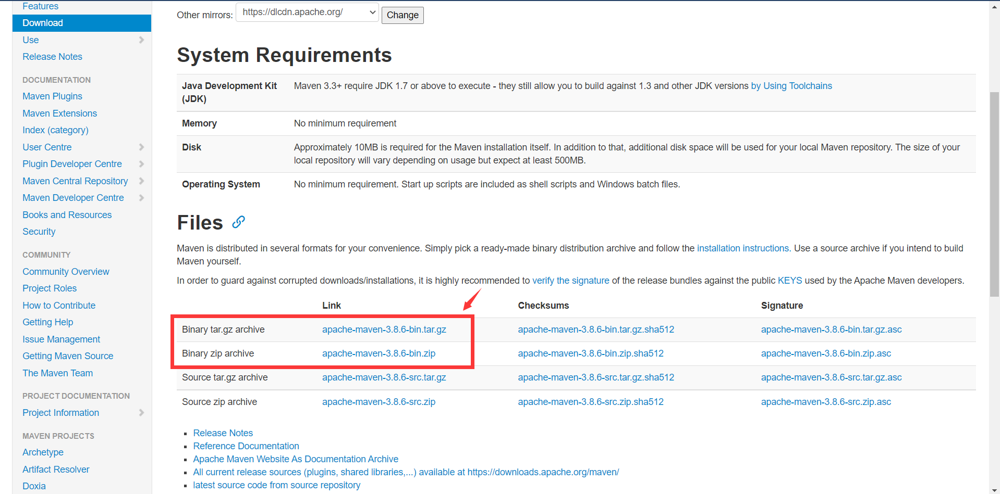
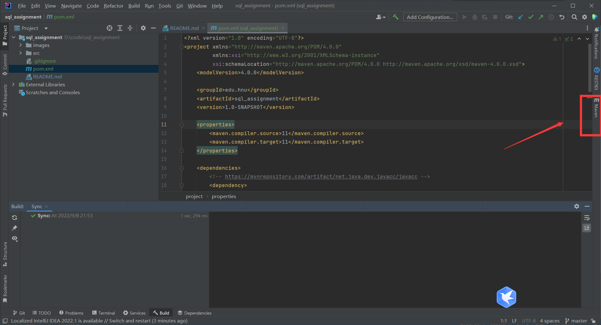

# HNU_Advanced_DB_Course_Framework

This project aims to construct the development environment for the `Advanced DB course` in HunNan University.

To this day, what we need is the tool named [Javacc](https://github.com/javacc/javacc). But it's terrible for the people who uses Java first to install it. We use the maven plugin `javacc-maven-plugin` to avoid that problem happens.

## 1. Quick Start

If you want to use that framework, what you need is only apply following process:

1. Download(or Git clone) that project to the file folder that you like. For convenience, we call the path of the folder is `< PATHA >`.
    ```shell
    git clone https://github.com/javacc/javacc.git
    ```

2. Install maven.（If you use the IDEA, you can skip this step. Because that the IDEA has the default maven）. 
   - You can download it from that [url](https://maven.apache.org/download.cgi).
   
   - And then, please unzip it to another file folder. We call the path of it is `< PathB >`。
    
    
    My `< PathB >` is `D:\Program Files\apache-maven-3.8.5-bin`. Please click into the folder `apache-maven-3.8.5`. You can find the file folder named `bin`:

    

    Then please record the path of the `bin`。Now we get the `<MAVEN_PATH>` `D:\Program Files\apache-maven-3.8.5-bin\apache-maven-3.8.5\bin`。
   - Configure environment variables for you computer. In win10, you can follow that process:
     - Right click the icon of `My Computer`。
        
     - Click the `Attribute`：
        
     - Click the `Advanced system setting`:
        
     - Click the `Environment Variables`
       
     - Find the `Path` in `System Variables`：
       
     - Append the `<MAVEN_PATH>` to it. 
        
3. If you don't want to use IDEA. Open the terminal of your computer, such as cmd, powershell and so on. `cd` into the `< PATHA >`, run 
   ```shell
    mvn javacc:javacc
   ```
   You will find the file `src/main/resources/**/*.jj` transformed into `src/main/java/**.java`。

   That's completed.

4. If you use the IDEA. Import that project as a maven project.
   - Open that project
   - Open the `pom.xml`
   - Right click
   - Maven -> Reload project

   Waiting for the completion of reloading project.

   
   

   Then you will find lots of java files created.

   

Last but not least, pay attention to changing the package name.


If you want to create new java files, please delete the old. Otherwise, it can't be as you wish.